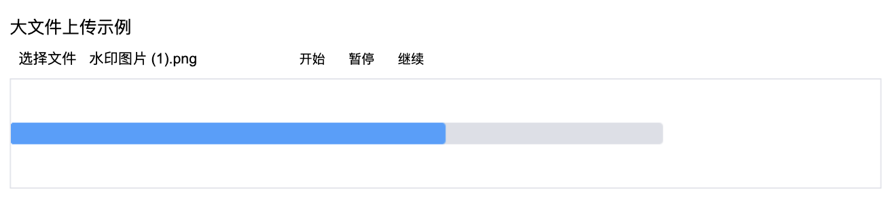
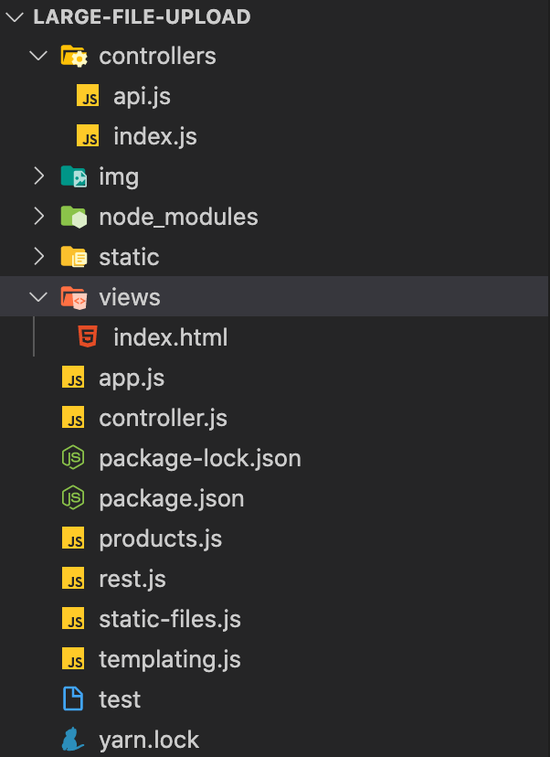
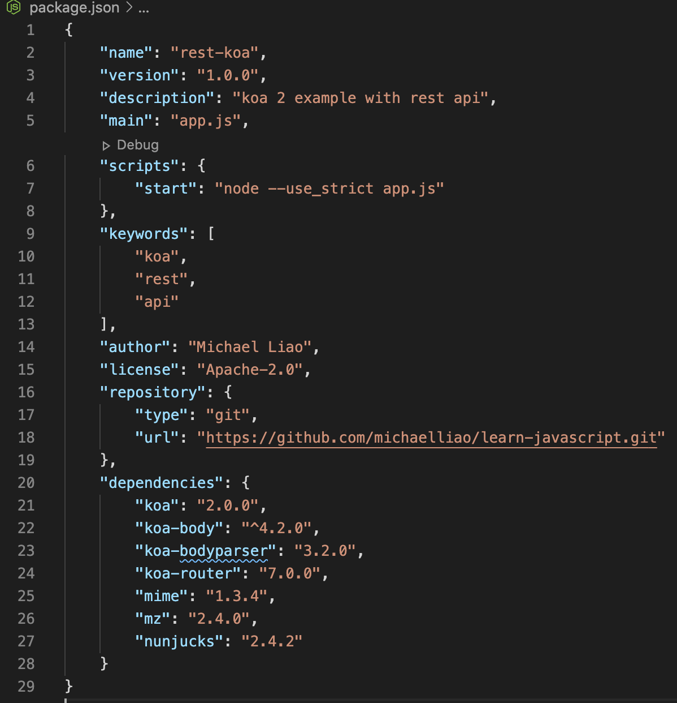

## 大文件上传的技术实现

### 前言

文件上传是网页操作中很常见的功能, 只要给 html 的 input 标签设置一个file 类型，配合form 表单，我们可以很轻易的实现一个文件上传功能，这种实现方案满足大多数情景下的需求，毕竟最常见的需求只是要你上传一个照片、简历、少量的excel 数据；但是遇到大文件比如几百M或者几个G，这种简单的实现方案就暴露出来它的致命缺点：
1. 单个 http 连接在传输中极易因网络原因等中断，导致需要重新建立 http 服务；
2. 无法对上传过程进行控制，如暂停、断点续传、上传进度展示等；


于是大文件上传解决方案应运而生，工具类软件中经常有相关的场景，这里记录我自己实践的一套基础示例

### 实现方案：

前端(vanilla.js) + 后端（node）+ 数据库 （mysql)

前端界面效果：


### 环境准备
这次以 Node 为主，通过 koa、node 搭建一套基础开发环境，提供 rest api 给前端调用，前端就一个页面就不单独搭建服务了，将其集成到一起，代码结构为



### 前端处理
#### 切片
文件处理第一步是把文件切割成一个个的小文件流，可以按照固定大小来分割或者百分比的方式都可以，然后将切片放到一个数组对象里

注意点：
  1. 切片单位 100kb || or
  2. 切片身份标示ID
  3. 切片索引值 Index
  4. 根据长度截取每次需要上传的数据
  5. File对象继承自Blob对象，因此包含slice方法

```
// 代码片段
const slice = (file, piece) => {
  let totalSize = file.size; // 文件总大小
  let start = 0; // 每次上传的开始字节
  let end = start + piece; // 每次上传的结尾字节
  let chunks = [];
  while (start < totalSize) {
    let blob = file.slice(start, end);
    chunks.push(blob);
    start = end;
    end = start + piece;
  }
  return chunks;
}
let file = document.querySelector("[name=file]").files[0];
const LENGTH = 1024 * 1024 * 0.1;
let chunks = slice(file, LENGTH);
```
#### 分片发送 && 通知 ending
这里没有做节流处理，因为是示例，如果业务场景下就需要控制异步发送的频率了，这里我定义了一个任务数组，把分片后的每个数据流包装成一个http promise，这样通过Promise.all 来异步批量请求，将分片数据流传输给node 服务，在数据传输完成后 调用 mkFile 接口告知服务器进行文件合成操作。
```
// 代码片段
let tasks = [];
chunks.forEach((chunk, index) => {
  let formData = new FormData();
  formData.append("file", chunk);
  formData.append("context", file.name);
  formData.append("chunk", index + 1); 
  tasks.push(post("/api/postLargeFile", formData));
});
Promise.all(tasks).then((res) => {
  let formData = new FormData();
  formData.append("context", context);
  formData.append("chunks", chunks.length);
  post("/api/mkFile", formData);
});
```
### Node 端接口处理
服务端主要是提供两个接口，一个切片文件接收，一个文件合成通知接收；对切片的处理中，要先临时保存到本地文件夹中，在之后文件合成后销毁;

#### 切片文件接收
切片注意点：
1. 判断是否是初始请求，需要的话要生成此文件对应的文件夹
2. 文件流的基本操作
3. 获取上传文件
4. 读取文件流
5. 设置文件保存路径
6. 组装成绝对路径
```
// 代码片段
"POST /api/postLargeFile": async (ctx, next) => {
  if (!fs.existsSync(`img/${ctx.request.body.context}-slice`)) {
    fs.mkdir(`img/${ctx.request.body.context}-slice`, 0777, (res) => {
      if (res) {
        const file = ctx.request.files.file;
        const fileReader = fs.createReadStream(file.path);
        const filePath = path.join(
          __dirname,
          `../img/${ctx.request.body.context}-slice`
        );
        const fileResource = filePath + `/${ctx.request.body.chunk}`;
        const writeStream = fs.createWriteStream(fileResource);
        fileReader.pipe(writeStream);
      } else {
        console.log("写入 fail");
      }
      return;
    });
  }
  const file = ctx.request.files.file;
  const fileReader = fs.createReadStream(file.path);

  const filePath = path.join(
    __dirname,
    `../img/${ctx.request.body.context}-slice`
  );
  const fileResource = filePath + `/${ctx.request.body.chunk}`;
  const writeStream = fs.createWriteStream(fileResource);
  fileReader.pipe(writeStream);
  ctx.rest({ code: 200 });
}
```
#### 文件合成
文件合成就是把之前保存的文件流片段重新按照次序生成一个新的完整文件的过程。

合成注意点：
1. 文件夹中文件目录读取，排序
2. 按照次序将文件流入新管道，生成合成文件
3. 合成后销毁临时文件
```
// 代码片段
"POST /api/mkFile": async (ctx) => {
  const writeStream = fs.createWriteStream(`img/${ctx.request.body.context}`);
  const filePath = path.join(
    __dirname,
    `../img/${ctx.request.body.context}-slice`
  );
  let currentFile;
  fs.readdir(filePath, (err, files) => {
    if (err) return;
    const newFiles = files.sort((a, b) => a - b);
    let main = () => {
      if (!newFiles.length) {
        writeStream.end("Done");
        return;
      }
      currentFile = `${filePath}/${newFiles.shift()}`;
      readStream = fs.createReadStream(currentFile);
      readStream.pipe(writeStream, { end: false });
      readStream.on("end", function () {
        main();
      });
    };
    main();
  });
  ctx.rest({
    code: 200,
    msg: "文件已合成",
  });
}
```
#### 保存到数据库
这是最后一步，生成的完整文件需要通过 mysql 等数据库保存下来，然后再提供一个查询的 Api，这样一个基础的文件上传流程就走完了，关于数据库的基本操作，这里就不赘述了，有兴趣可以到本文示例源码查看。